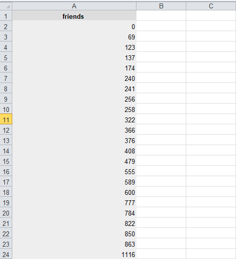
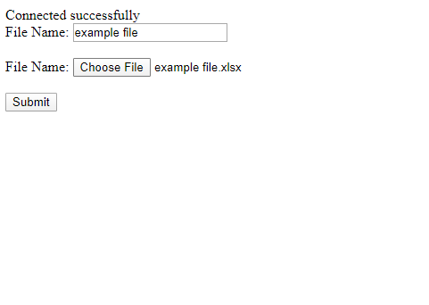
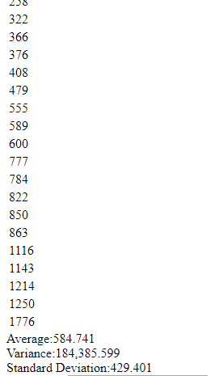

# PHP Data Analytics

Its a web based application. The application reads numerial data from a excel file. The file that has only one column with a column heading. Then calculate average, variance and standard deviation of the given data. MVC pattern is followed for developing this application.

## Technologies

PHP 7.2, Mysql

## Version

1.0.1

## Manual
This version is not a full and final application. Thats why the manual is not attached here. But anyone can run this application under the apache server with the supporting technologies mentioned in the Technologies section. Simply keep the folder in the root directory server and configure the database setting in the file DB.php which is located in class folder. 

## Folder and File Structure (Model-Ciew-Controller)
  -class: folder  
  --DB.php: Database configuration clas  
  --momController.php: The base controller class  
  --statisticsController.php: class for handeling statistics functions  
  -lib:folder contains library for handeling excel file  
  -uploads: Uploaded files are keept here  
  -view: folder contains view files  
  -index.php: Home page class  
  -screen_shot: images of application's output  
  -example file.xlsx  

## Future Update
The application is being developed. So, It will be updating time to time.  

## Authors

* **ABU YUSUF** - [mayusuf](https://github.com/mayusuf)